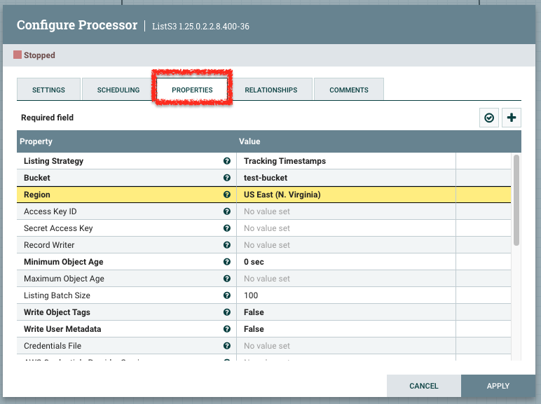
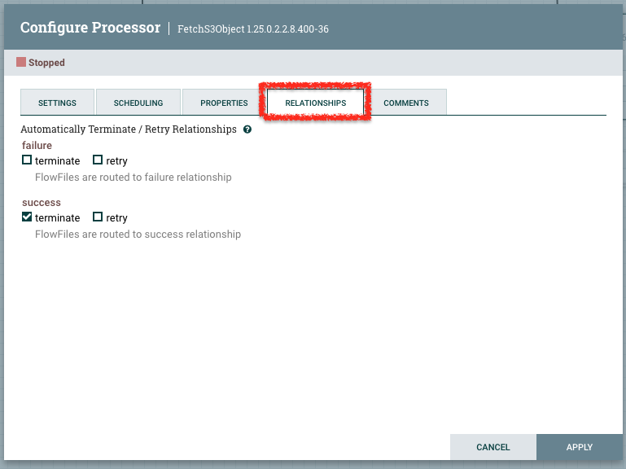
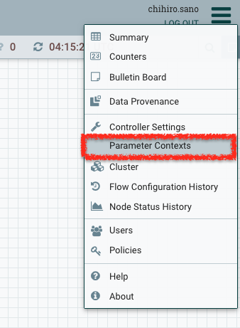
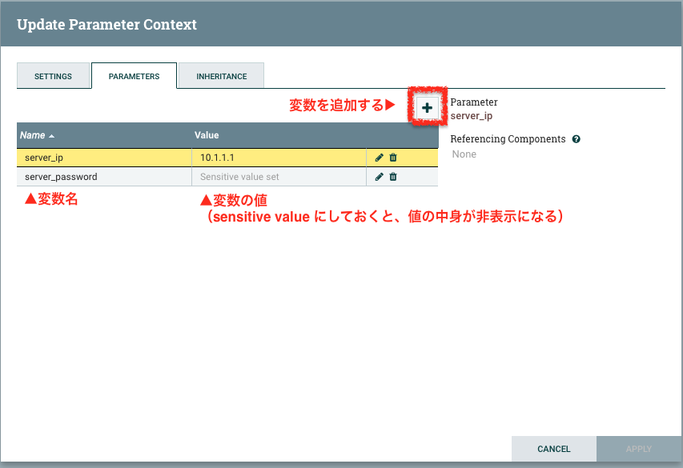
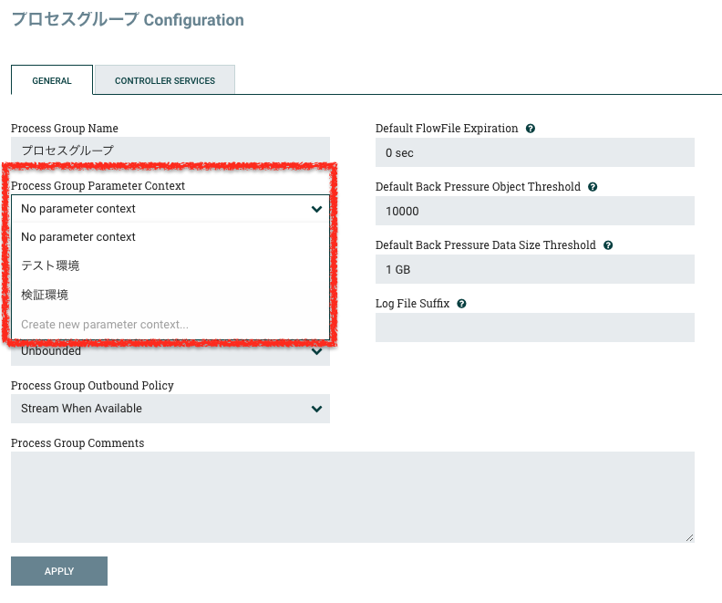
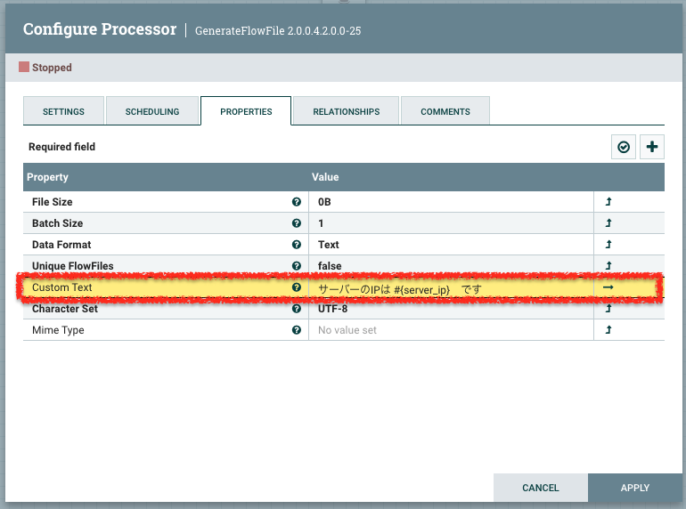
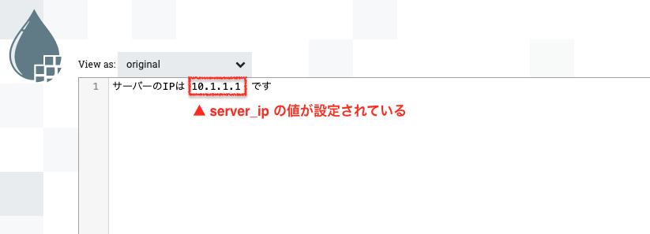
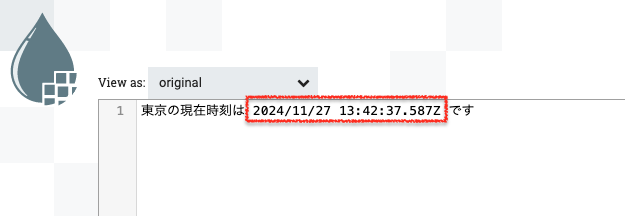

# NiFi フローの作り方

NiFi のフローは、新規で作成するか、既存のフローをエクスポート・インポートして作成することができます。

既存フローのエクスポート・インポートの手順については、下記の動画でわかりやすく解説しています。

https://www.youtube.com/watch?v=1RnQG7Fu6Ds

（上記は英語動画です。日本語での説明を準備中です。）

このページでは、フローを新規で作成したり、インポートしたフローを修正する際の基本となる内容を解説します。

## 基本編

### 主なプロセッサー

NiFi フローでよく利用するプロセッサーについては、以下のページを参照してください。
[NiFiの主なプロセッサー](processors.md)

### プロセッサーの設定項目

プロセッサーの主な設定項目として、プロパティ、スケジュール、リレーションシップがあります。
該当のプロセッサーをダブルクリックすることで、それぞれの設定タブを参照できます。

#### プロパティ

フローファイルに対する処理内容や、データの入力元・出力先などとの接続情報を定義します。  
太字の項目が必須項目です。

#### スケジュール

各プロセッサーの処理スケジュールを設定するタブです。

基本となる設定項目は以下です。

- Scheduling Strategy
  - Timer driven (何分/何秒置きに稼働する) または CRON driven (CRON指定) を選択します。
- Run Schedule
  - Timer driven の場合は min または sec 単位で何分／何秒置きに稼働するかを指定します
  - CRON driven の場合は、CRON形式で稼働スケジュールを指定します
- Execution
  - 1ノードのみで稼働させる場合はPrimary node, 並列処理を行う場合は All nodes を選択します

スケジュールは、以下のように設定するのが一般的です。

- 処理の先頭のプロセッサー
  - 特定のスケジュールを設定
- 後続処理
  - Timer driven かつ Run Schedule を 0 sec とする

こうすることで、特定のタイミングで処理を開始しつつ、後続処理は先行プロセッサーが完了次第稼働する仕組みとなります。

#### リレーションシップ

処理結果に応じて、後続処理をどのように振り分けるのかを指定する項目です。

リレーションシップの数や種類は、プロセッサーによって異なります。  
NiFi フローを動かすためには、すべてのリレーションシップが後続処理へのキューにつながっているか、またはこのタブの中で終結されている（terminate / retry が選択されている）必要があります。

## 応用編

### Controller Services

複数のプロセッサーが共通して利用するリソース（認証情報やスキーマなど）を一元管理するためのサービスです。  
データベースとの接続のためのコネクションプールや、データに適用するスキーマの指定などは、Controller Services を活用して設定すると便利です。

### パラメータコンテキスト

処理の中で指定するパラメータをまとめておくための変数のかたまりです。
各プロセッサーの中で使用するパスや認証情報などがテスト環境と本番環境で異なる場合などに、テスト環境用／本番環境用にそれぞれパラメータコンテキストを用意するような形で利用します。

パラメータコンテキストは、画面右上のハンバーガーマークから作成・編集できます。

上記でパラメータコンテキストメニューを選択すると、以下のように、作成済みのパラメータコンテキスト一覧が表示されます。  

パラメータコンテキストを新規に作成、または編集する画面では、以下のように変数を作成・編集することができます。

パラメータコンテキストは、プロセッサーグループごとに指定することができます。  
プロセッサーグループの設定欄から、以下のように、割り当てるパラメータコンテキストを指定します。

ひとつのパラメータコンテキストを複数のプロセッサーグループに割り当てることは可能ですが、ひとつのプロセスグループに複数のパラメータコンテキストを割り当てることはできません。

パラメータコンテキストに設定した変数の値をプロセッサーのパラメータ等に設定したい場合、`#{変数名}` という形で指定します。
たとえば、上記の図で設定したパラメータコンテキスト内の変数 `server_ip` の値を GenerateFlowFile プロセッサーの Custom Text の中で取得したい場合、以下のように指定します。

上記のプロセッサーを処理すると、以下のような Content を持つ Flowfile がキューに入ります。

※上記の図では説明用にIPアドレスを文字列として表示していますが、実際に利用するシーンでは、データの取得元や送信先となるサーバーのIPアドレスを指定するパラメータなどに設定することが多いです。

### NEL (NiFi Expression Language)

NiFi のプロセッサーでは、ちょっとした文字列の置き換えや論理演算、時刻の取得などの処理を NiFi Expression Language (NEL) を使って行うことができます。  

代表的なものとして、たとえば現在時刻を日本時間で `2024/11/27 18:36:03.264Z` のような形式で取得してプロセッサーのパラメータ等に設定したい場合、 `${now():format("yyyy/MM/dd HH:mm:ss.SSS'Z'", "Asia/Tokyo")}` という NEL を使って実現することができます。

以下は GenerateFlowFile プロセッサーの Custom Text で、東京の現在時刻を設定している例です。

上記のプロセッサーを処理すると、以下のような Content を持つ Flowfile がキューに入ります。

NELでは上記のような現在時刻の取得以外にも、文字列の置き換えや論理演算など、様々なことができます。　　
すべての機能の詳細は、[NELの解説ドキュメント](https://nifi.apache.org/docs/nifi-docs/html/expression-language-guide.html)をご参照ください。
